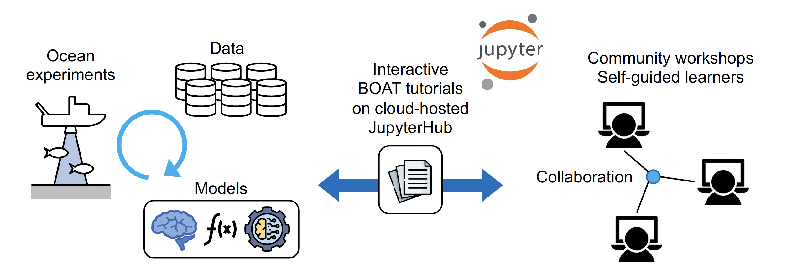

# Welcome to {{hackweek}}!

The Bridge to Ocean Acoustics and Technology (BOAT) program aims to broaden access to ocean acoustics by empowering learners to explore and advance the field through collaboration and shared knowledge. Our focuses are:
1) Developing open, executable, and web-hosted tutorials that encapsulate fundamental ocean acoustics knowledge and techniques as living documents.
2) Growing the ocean acoustics education and research community through interactive and collaborative workshops.



We emphasize the development of physical and mathematical intuitions through hands-on computational examples first, inspiring and motivating learners to dive deeper into specific topics of their choice. 

As an example, below is an interactive "widget" made in Python that demonstrates how the beampattern of a circular piston transducer changes with the sound frequency and its radius.


Looking ahead, we envision maintaining a collection of tutorial modules backed by a persistent cloud-hosted computing environment, to a space for the ocean acoustics community to learn and explore collaboratively beyond in-person or virtual workshops.


```{admonition} Quick links
:class: seealso
* [Seattle workshop](./workshop_seattle) (March 24-25, 2025)
* [New Orleands workshop](./workshop_new_orleans) (May 17-18, 2025)
* GitHub organization: {{ github_org_url }}
```
